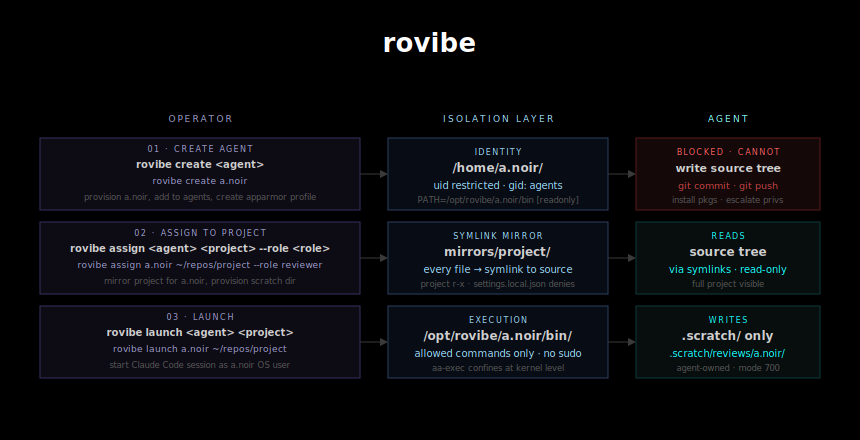

<div align="center">

[](https://aur.archlinux.org/packages/rovibe)
[](LICENSE)

</div>



 
I have found it useful to run Claude Code sessions as their own user accounts, granting
execute and write permissions only to the
files and commands necessary for the scope of the work. 
`settings.json` config files don't
actually guarantee this, so I threw together a tool that can. Sort of like 
virtual environments, but for users and enforced by the kernel instead of the runtime.

Maintained for Arch Linux. Exploring options for Mac.

## How it works

Each agent gets:
- A dedicated Linux user account in the `agents` group
- A per-agent bin directory (`/opt/rovibe/<agent>/bin/`) with symlinks
  to approved system binaries — nothing else is in PATH
- A read-only symlink mirror of the target project
- A writable scratch space for output
- An AppArmor profile (if available) enforcing the allowlist at the
  kernel level

## Threat model

**Without AppArmor:** Identity and filesystem isolation only. Each agent
gets its own user account and can only *find* commands in its allowlist
via PATH. Absolute paths (`/usr/bin/curl`), `python3 os.system()`, and
similar bypasses still work. Useful for audit trails and preventing
accidental damage, not for confining adversarial agents.

**With AppArmor:** Hard execution boundary at the kernel level. Every
`exec()` syscall is mediated — only binaries explicitly in the agent's
profile can run, regardless of how the path was obtained. `python3`
subprocess, `find -exec`, `bash --norc`, all blocked.


## Installation

### Arch Linux
```bash
yay -S rovibe
```

**Optional: enable AppArmor** for hard execution sandboxing. Add
`lsm=landlock,lockdown,yama,integrity,apparmor,bpf` to
`GRUB_CMDLINE_LINUX_DEFAULT` in `/etc/default/grub`, then:
```bash
sudo grub-mkconfig -o /boot/grub/grub.cfg
sudo systemctl enable --now apparmor
sudo reboot
```

### Manual
```bash
git clone https://aur.archlinux.org/rovibe.git
cd rovibe
sudo bash install.sh
```

## Usage

```bash
$ rovibe -h
Usage: rovibe <command> [args...]

Commands:
  create <username> [--profile <profile>]  Create an isolated agent identity
                                           Profiles: read-only, standard (default),
                                                     network-isolated
  delete <username>                        Delete an agent identity
  assign <agent> <project> [--role <role>] Assign agent to project
  unassign <agent> <project>               Remove agents project assignment
  launch <agent> <project>                 Launch an agent session
  list [<agent>|<project>]                 List agents and assignment status
  allow <agent> <cmd> [<cmd> ...]          Allow agent to run commands
  restrict <agent> <cmd> [<cmd> ...]       Revoke agents access to commands
  sync <project>                           Sync all mirrors for a project
  uninstall [--purge]                      Remove rovibe from the system


# Create an agent (profiles: standard, read-only, network-isolated)
$ rovibe create a.noir
[create-agent] Creating user 'a.noir'...
...
[allow]   allowed ln -> /usr/bin/ln
[allow]   allowed more -> /usr/bin/more
[allow]   allowed less -> /usr/bin/less
[allow]   allowed which -> /usr/bin/which
[allow]   allowed env -> /usr/bin/env
[allow]   allowed envsubst -> /usr/bin/envsubst
[allow]   allowed node -> /usr/bin/node
[allow] AppArmor profile updated — changes take effect on next launch
[create-agent] AppArmor profile generated: rovibe-a.noir
[create-agent] Writing restricted .bashrc...
[create-agent] Writing .bash_profile...
[create-agent] Writing limits.conf...
[create-agent] Agent 'a.noir' created.
[create-agent] Profile: standard
[create-agent] Home: /home/a.noir
[create-agent] PATH: /opt/rovibe/a.noir/bin

# Assign agent to a project
$ rovibe assign a.noir ~/repos/rovibe --role reviewer
[assign] Setting agents group permissions on /home/nknowles/repos/rovibe...
[assign] Creating symlink mirror at /home/a.noir/mirrors/rovibe...
[sync-mirror] Syncing /home/nknowles/repos/rovibe -> /home/a.noir/mirrors/rovibe
[sync-mirror]   dir:  aur
[sync-mirror]   link: aur/PKGBUILD -> /home/nknowles/repos/rovibe/aur/PKGBUILD
[sync-mirror]   link: aur/rovibe.install -> /home/nknowles/repos/rovibe/aur/rovibe.install
[sync-mirror]   dir:  docs
[sync-mirror]   link: docs/generate-rov_diag.py -> /home/nknowles/repos/rovibe/docs/generate-rov_diag.py
[sync-mirror]   link: docs/rovibe-diag.svg -> /home/nknowles/repos/rovibe/docs/rovibe-diag.svg
[sync-mirror]   link: .gitignore -> /home/nknowles/repos/rovibe/.gitignore
[sync-mirror]   link: install.sh -> /home/nknowles/repos/rovibe/install.sh
[sync-mirror]   dir:  lib
[sync-mirror]   link: lib/allow -> /home/nknowles/repos/rovibe/lib/allow
[sync-mirror]   link: lib/apparmor -> /home/nknowles/repos/rovibe/lib/apparmor
[sync-mirror]   link: lib/assign -> /home/nknowles/repos/rovibe/lib/assign
[sync-mirror]   link: lib/create-agent -> /home/nknowles/repos/rovibe/lib/create-agent
[sync-mirror]   link: lib/launch -> /home/nknowles/repos/rovibe/lib/launch
[sync-mirror]   link: lib/list -> /home/nknowles/repos/rovibe/lib/list
[sync-mirror]   link: lib/restrict -> /home/nknowles/repos/rovibe/lib/restrict
[sync-mirror]   link: lib/sync-mirror -> /home/nknowles/repos/rovibe/lib/sync-mirror
[sync-mirror]   link: lib/unassign -> /home/nknowles/repos/rovibe/lib/unassign
[sync-mirror]   link: lib/uninstall.sh -> /home/nknowles/repos/rovibe/lib/uninstall.sh
[sync-mirror]   link: LICENSE -> /home/nknowles/repos/rovibe/LICENSE
[sync-mirror]   link: README.md -> /home/nknowles/repos/rovibe/README.md
[sync-mirror]   link: rovibe -> /home/nknowles/repos/rovibe/rovibe
[sync-mirror]   dir:  tests
[sync-mirror]   link: tests/isolation.bats -> /home/nknowles/repos/rovibe/tests/isolation.bats
[sync-mirror]   link: tests/README.md -> /home/nknowles/repos/rovibe/tests/README.md
[sync-mirror] Sync complete.
[assign] Creating .scratch workspace at /home/nknowles/repos/rovibe/.scratch/reviews/a.noir...
[assign]   Symlinked .scratch into mirror
[assign] Writing .claude/settings.local.json in mirror...
[assign] Agent 'a.noir' assigned to 'rovibe'.
[assign] Mirror: /home/a.noir/mirrors/rovibe
[assign] Scratch: /home/nknowles/repos/rovibe/.scratch/reviews/a.noir

# Add a binary to allowlist
$ rovibe allow a.noir node 
[allow]   allowed node -> /usr/bin/node
[allow] AppArmor profile updated — changes take effect on next launch

# Remove a binary from allowlist 
$ rovibe restrict a.noir node
[restrict]   restricted node
[restrict] AppArmor profile updated — changes take effect on next launch

# Launch a session
$ rovibe launch a.noir ~/repos/rovibe
#################
#--claude code--#
#################

# List agents and assignments
$ rovibe list
AGENT                PROFILE              PROJECTS
-----                -------              --------
a.red                standard             rovibe (genius)
a.noir               custom               rovibe (reviewer)

# List agent
$ rovibe list a.noir
AGENT: a.noir
PROFILE: custom
APPARMOR: enforcing
PROJECT              ROLE         LAST ACTIVE          SOURCE
-------              ----         -----------          ------
rovibe               reviewer     02-23-2026 17:46     /home/nknowles/repos/rovibe

# List project dir
$ rovibe list ~/repos/rovibe
PROJECT: rovibe  (/home/nknowles/repos/rovibe)
AGENT                ROLE         LAST ACTIVE
-----                ----         -----------
a.red                genius       02-24-2026 23:33
a.noir               reviewer     02-23-2026 17:46

# Delete the agent user and purge its files 
$ rovibe delete a.noir
[sudo] password for nknowles:
[rovibe] Deleting agent 'a.noir'...
[rovibe] Removed AppArmor profile: rovibe-a.noir
[rovibe] Agent 'a.noir' deleted.

```

## Profiles

Profiles control the default binary allowlist at creation time.

| Profile | Description |
|---|---|
| `standard` | Full allowlist including curl, git, vim, python3. Default. |
| `read-only` | Zero-risk commands only. No network, no editors, no runtimes. |
| `network-isolated` | Standard minus curl, wget, git. |
| `custom` | Set automatically when you run `allow` or `restrict`. |

## Filesystem layout
```
/opt/rovibe/<agent>/bin/          # per-agent PATH (symlinks to approved binaries)
/opt/rovibe/<agent>/.rovibe-profile

/home/<agent>/mirrors/<project>/  # read-only symlink mirror
    .scratch -> <project>/.scratch/reviews/<agent>/
    .claude/settings.local.json
    src/file.py -> /path/to/src/file.py

<project>/.scratch/reviews/<agent>/  # writable scratch space

/etc/apparmor.d/rovibe/rovibe-<agent>  # AppArmor profile (if available)
```

## Requirements

- `apparmor` — optional, strongly recommended
- `fswatch` — optional, enables live mirror sync during sessions

